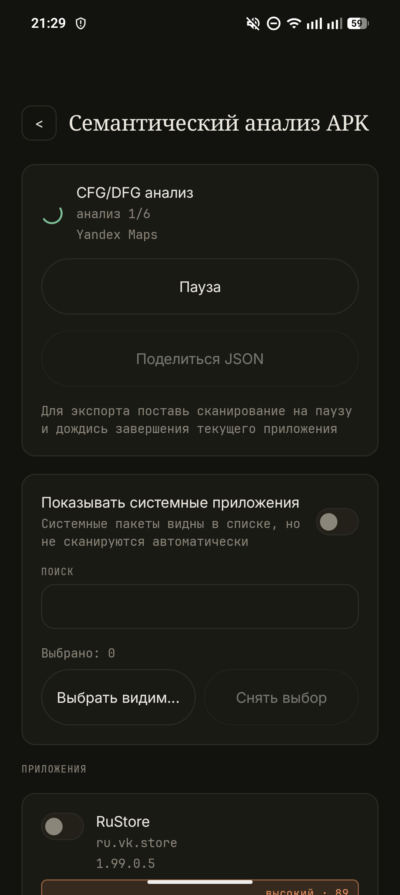
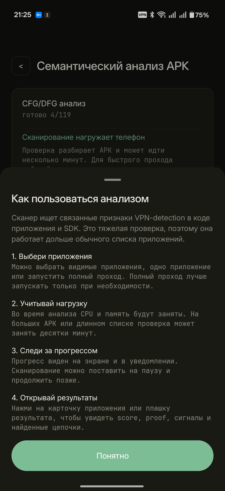
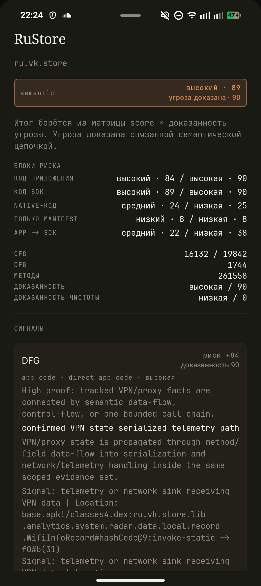
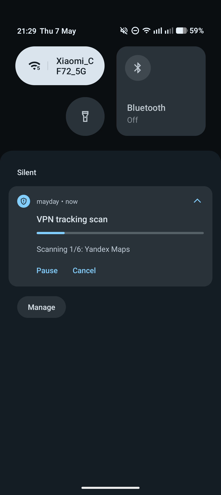

# mayday Android

[English version](README.md)

mayday - Android-клиент для защищенного подключения с простым управлением, понятным отображением статуса и практичными настройками для ежедневного использования.

Приложение рассчитано на пользователей, которым нужен компактный клиент подключения с современным интерфейсом, быстрым доступом из системной шторки и выбором приложений, которые используют защищенное подключение.

## Возможности

- Чистый Android-интерфейс с адаптивной светлой и темной темой.
- Первичная настройка при первом запуске с импортом ключа Mayday или продолжением без конфигурации.
- Настройка только по ключу: вставка ключа, импорт из буфера обмена или ссылка `mayday://import/...`.
- Главный экран сфокусирован на статусе подключения, ID пользователя и понятных кнопках подключения/отключения.
- Предупреждение о несовместимости, если сохраненный ключ больше не подходит к текущей версии приложения.
- Автопроверка релизов GitHub с небольшим баннером, когда доступна новая версия.
- Настройки подключения для режима транспорта, MTU, обработки пакетов, спасения сети и поведения проверок.
- Всплывающий выбор транспорта, который помещает длинные названия и новые варианты транспорта.
- Разворачиваемая расширенная диагностика для протокола, скорости, endpoint-ов и технических деталей.
- Split tunneling с выбором приложений.
- Отдельный экран для управления выбранными приложениями.
- Проверка установленных приложений на устройстве на признаки шпионского, надзорного или отслеживающего поведения.
- Плитка Quick Settings для подключения и отключения из системной шторки Android.
- Постоянное уведомление со статусом подключения и действиями подключения.
- Интерфейс на английском и русском языках.
- Автоматический выбор языка при первом запуске на основе языка системы.
- Локальное сохранение профиля и настроек интерфейса.

## Импорт конфигурации

mayday теперь использует импорт через ключ. Пользователь может вставить ключ Mayday, импортировать его из буфера обмена или открыть ссылку `mayday://import/...`.

Сырые файлы профиля и ручной импорт YAML не входят в пользовательский флоу. Если сохраненный ключ был создан под старые требования приложения, mayday покажет предупреждение и попросит получить новый ключ.

## Экраны

- Главный экран: текущее состояние подключения, ID пользователя, баннеры обновления и совместимости, основные действия подключения и разворачиваемая расширенная диагностика.
- Первичная настройка: старт приложения с импортом ключа, импортом из буфера обмена или пропуском.
- Настройки: параметры приложения, импорт ключа, настройки подключения и расширенные опции.
- Split tunneling: выбор приложений для использования защищенного подключения.
- Проверка приложений: сканирование установленных приложений с уровнями риска и основаниями.

Скриншоты проверки приложений:

  
  
  
  

## Структура Android-приложения

Проект разделен на несколько Android-слоев:

- App layer: точка входа приложения, навигация и настройка зависимостей.
- Feature layer: пользовательские экраны и состояние экранов.
- Core layer: общие модели, хранение данных, дизайн-система и интеграция с Android-платформой.

Этот README ограничен описанием интерфейса Android-приложения и общей организации проекта.

## Совместимость

- Android 10 или новее.
- APK содержит native runtime для arm64-v8a.
- Старые ключи может потребоваться обновить, если приложение показывает предупреждение о совместимости.

## Release Notes

Release notes хранятся в [docs/release-notes](docs/release-notes).

Текущие release notes доступны здесь: [mayday 2.1.4](docs/release-notes/2.1.4.md).
